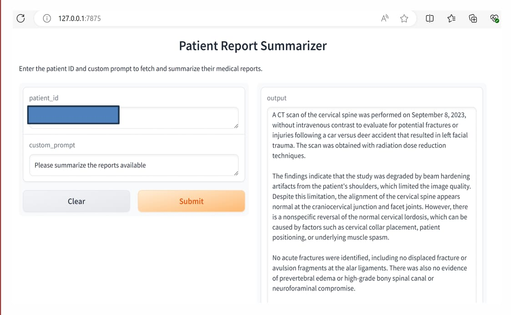

# Radiology Report Summarization

This project implements a **Retrieve-Augment-Generate (RAG)** framework for summarizing radiology reports using **Gradio** for UI and **SQLite** for data management.

## 🖼️ Interface Preview


## 🚀 Features
- **Database & LLM Integration**: Uses SQLite and LM Studio/Ollama for local inference.
- **RAG Framework**: Retrieves relevant reports, enhances context, and generates summaries.
- **Gradio Interface**: Provides a real-time UI for querying reports.
- **Flexible Deployment**: Supports both local and Hugging Face API-based summarization.

## 📂 Project Structure
```
├── database_setup.py    # Initializes SQLite and loads data
├── radiology_report_rag.py  # Main Gradio app for querying & summarization
├── data/
│   ├── Syn_Radiology_Reports_Dataset.csv   # Synthetic Dataset 
├── requirements.txt    # Python dependencies
├── .env   # Store Hugging Face API Key securely
├── README.md   # Project documentation
```

## 🔧 Setup & Installation
1. **Clone the repository:**
   ```bash
   git clone https://github.com/AmulyaVeldandi/radiology-report-summarization.git
   cd radiology-report-rag
   ```
2. **Install dependencies:**
   ```bash
   pip install -r requirements.txt
   ```
3. **Set up the database:**
   ```bash
   python database_setup.py
   ```

## 🌟 Running the App
```bash
python app.py
```
By default, the app runs on `http://127.0.0.1:7860/`.

## 🔑 API Key Setup (For Hugging Face)
- Create a `.env` file and add:
  ```
  HUGGINGFACE_API_KEY=your_api_key_here
  ```

## 🛠️ Future Enhancements
- Add filtering options
- Enhance LLM responses
- Support multi-modal retrieval

📢 Contributions are welcome!
